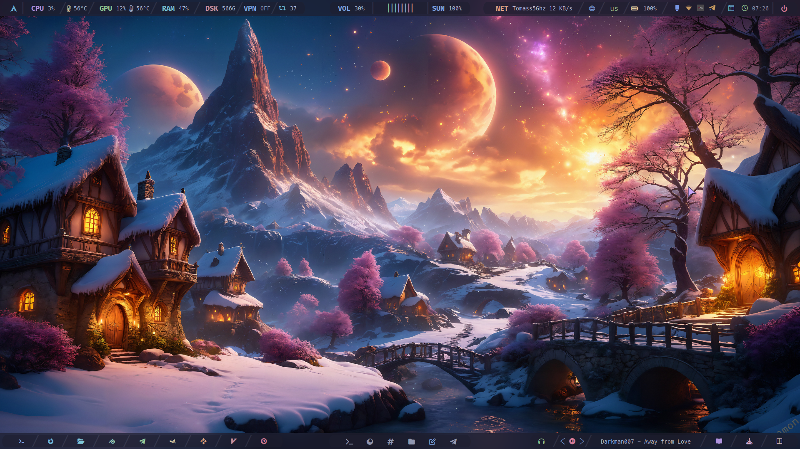
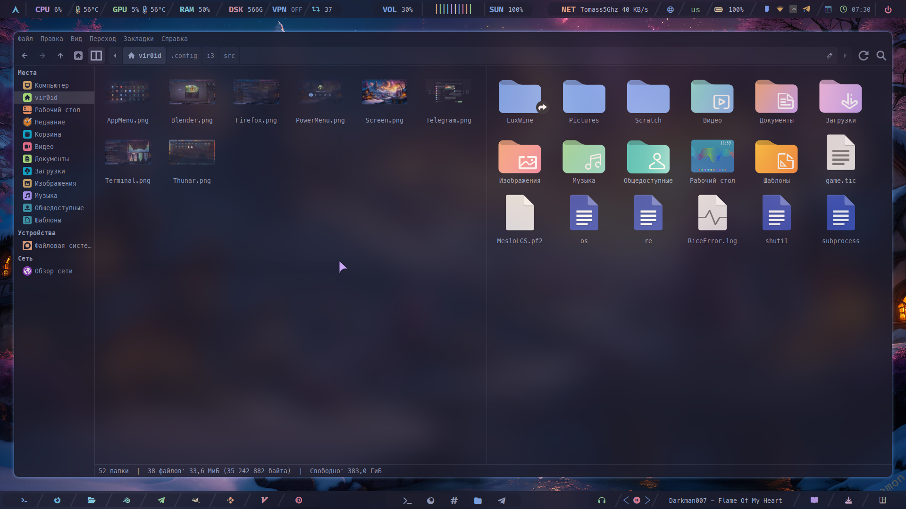
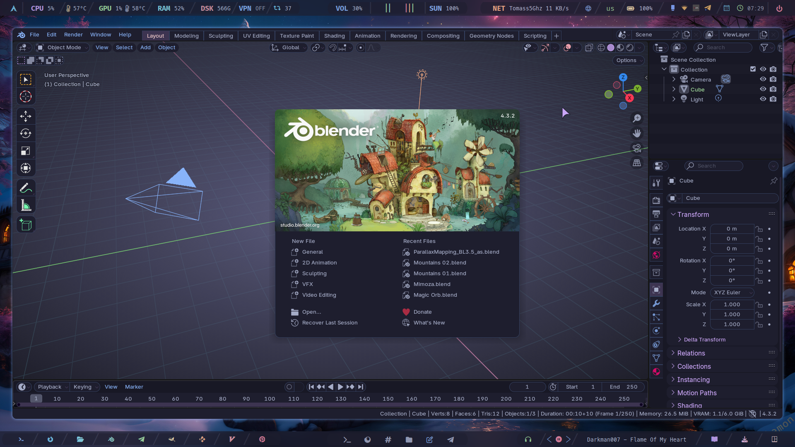

## Information


- **OS:** [Any Arch Based Distro](https://en.wikipedia.org/wiki/Arch_Linux)
- **WM:** [i3-wm](https://github.com/Airblader/i3)
- **Terminal:** [Kitty](https://sw.kovidgoyal.net/kitty/)
- **Text Editor:** [Visual-code](https://code.visualstudio.com/) [Micro](https://micro-editor.github.io/)
- **File Manager:** [Thunar](https://github.com/neilbrown/thunar) [Ranger](https://github.com/ranger/ranger)
- **Fonts:** [MesloLGS NF](https://github.com/romkatv/powerlevel10k#meslo-nerd-font-patched-for-powerlevel10k) [Iosevka Term](https://github.com/be5invis/Iosevka)
- **Bar:** [Polybar](https://github.com/polybar/polybar)
- **Shell:** [Ohmyzsh](https://ohmyz.sh/)
- **Compositor:** [Picom](https://github.com/yshui/picom)
- **Application Launcher:** [Rofi](https://github.com/davatorium/rofi)
- **Notification Deamon:** [Dunst](https://github.com/dunst-project/dunst)
- **Splitt terminal:** [Autotiling](https://github.com/nwg-piotr/autotiling)
- **Video Card:** [Nvidia](https://developer.nvidia.com/nvidia-system-management-interface) [Intel](https://www.intel.com/content/www/us/en/support/articles/000005520/graphics.html)
- **Backlight:** [Nvidia-smi](https://developer.nvidia.com/nvidia-system-management-interface)
- **Music Player:** [Mpd](https://www.musicpd.org/) [ncmpcpp](https://wiki.archlinux.org/title/Ncmpcpp) [Ymuse](https://github.com/yktoo/ymuse)
- **Music Player Youtube Playlists:** [Mpv](https://mpv.io/)


Установочный скрипт тестировался на чистом Arch Linux в виртуальной машине. 
Если у вас появятся какие-то проблемы в процессе установки, то я вас предупрежу:
> [!CAUTION]
> ⚠️⚠️⚠️ Пожалуйста, сделайте бэкап!!
> см.в "Ручная установка"!! ⚠️⚠️⚠️  

Если у вас чистая система, тогда скрипт нужно запускать два раза. 
Первый раз это нужно для того, что бы Firefox создал свои файлы и каталоги настроек в ~/.mozilla/. 

> [!IMPORTANT]
> Важно запустить Firefox и закрыть.
> Затем запустить скрипт второй раз.

Если у вас система не с нуля, тогда скрипт запускается один раз.

Этот скрипт проверит, есть ли у вас необходимые пакеты, и если нет, тогда он их установит. 
Этот скрипт сделает бэкап сам в каталог ~/.Backup_files

<br>

> [!CAUTION]
> ⚠️⚠️⚠️ После запуска скрипта, вам будет предложены соглашения с вашими действиями.
> Будте на чеку!! ⚠️⚠️⚠️

<br>

После установки файлов последует перезагрузка. Если вы устанавливаете в виртуальную машину, тогода после входа в систему picom работать не будет.
Вам потребуется закоментировать строку запускающую picom в автостарт. ~/.config/i3/autostart

Скрипт так же можно использовать с Intel картой.








# Arch Linux Rice Installation Script

Этот скрипт предназначен для автоматической настройки и установки окружения на Arch Linux. Он устанавливает необходимые пакеты, настраивает темы, шрифты, иконки, а также применяет конфигурации для различных компонентов системы, таких как Firefox, SDDM, GRUB и другие.

## Функционал скрипта

1. **Установка зависимостей**:
   - Скрипт проверяет и устанавливает все необходимые пакеты из официальных репозиториев Arch Linux и AUR.
   - Устанавливает такие пакеты, как `firefox`, `alacritty`, `polybar`, `rofi`, `picom`, `zsh`, и многие другие.

2. **Установка AUR-помощника `paru`**:
   - Если `paru` не установлен, скрипт автоматически установит его для работы с AUR-пакетами.

3. **Установка AUR-пакетов**:
   - Скрипт устанавливает дополнительные пакеты из AUR, такие как `cava`, `tor-browser-bin`, `eww-git`, и другие.

4. **Резервное копирование файлов**:
   - Скрипт создает резервную копию текущих конфигурационных файлов в папку `~/.Backup_files`.

5. **Установка dot-файлов**:
   - Скрипт копирует конфигурационные файлы (dot-файлы) из текущей директории в домашнюю директорию пользователя.
   - Устанавливает темы для GRUB и SDDM.

6. **Настройка Firefox**:
   - Скрипт копирует темы и расширения для Firefox в соответствующие папки профиля.

7. **Настройка SDDM**:
   - Скрипт устанавливает и настраивает SDDM как менеджер входа в систему, применяя тему `catppuccin-mocha`.

8. **Настройка GRUB**:
   - Скрипт применяет тему `catppuccin-mocha` для GRUB.

9. **Настройка окружения**:
   - Скрипт настраивает окружение для работы с виртуальными машинами (libvirt) и добавляет пользователя в группу `libvirt`.
   - Настраивает MPD (Music Player Daemon) для работы на уровне пользователя.

10. **Смена оболочки на Zsh**:
    - Скрипт меняет оболочку по умолчанию на Zsh, если она еще не установлена.

11. **Перезагрузка системы**:
    - После завершения установки скрипт предлагает перезагрузить систему для применения всех изменений.

## Как использовать

1. **Клонируйте репозиторий**:
   ```bash
   git clone https://github.com/igorjoxa1118/NeoCity.git
   cd NeoCity
   chmod +x install.sh
   ./install.sh

Следуйте инструкциям:
Скрипт будет запрашивать подтверждение НЕ на каждом этапе установки. Внимательно читайте сообщения и отвечайте на вопросы.

Перезагрузите систему:
После завершения установки рекомендуется перезагрузить систему для применения всех изменений.

Логирование ошибок
Все ошибки, возникающие в процессе установки, записываются в файл RiceError.log, который находится в домашней директории пользователя. Если что-то пошло не так, проверьте этот файл для получения дополнительной информации.

Зависимости
Скрипт требует наличия следующих инструментов:

`sudo`
`git`
`pacman` (пакетный менеджер Arch Linux)
`curl` (для загрузки файлов)

Поддерживаемые окружения
Скрипт был протестирован на Arch Linux и производных дистрибутивах (например, Manjaro). Для других дистрибутивов могут потребоваться дополнительные настройки.

Автор

[vir0id]

|        Keybind         |                 Function                 |
| ---------------------- | ---------------------------------------- |
| `Mod + Q`              | Закрыть окно                             |
| `Mod + D`              | Открыть appmenu                          |
| `Mod + [1-9]`          | Переключить рабочее простронство [1-9]   |
| `Mod + Shift + [1-9]`  | Передвинуть окно на пространство [1-9]   |
| `Mod + H`              | Разделение окон по вертикали             |
| `Mod + V`              | Разделение окон по горизонтали           |
| `Mod + Shift + R`      | Перезапустить i3                         |
| `Mod + Enter`          | Открыть терминал                         |
| `Alt + Enter`          | Открыть терминал в режиме ranger         |
| `Mod + C`              | Сделать окно плавающим и обратно         |
| `Mod + T`              | Разделить закладки в строку              |
| `Mod + Y`              | Разделить закладки в столбик             |
| `Mod + U`              | Разделить закладки                       |
| `Print`                | Скриншот экрана                          |

> Подробнее смотреть в ~/.config/i3/keybinds