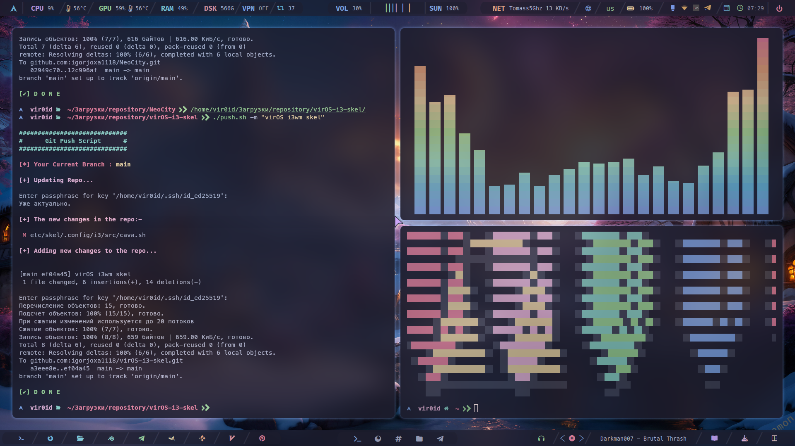
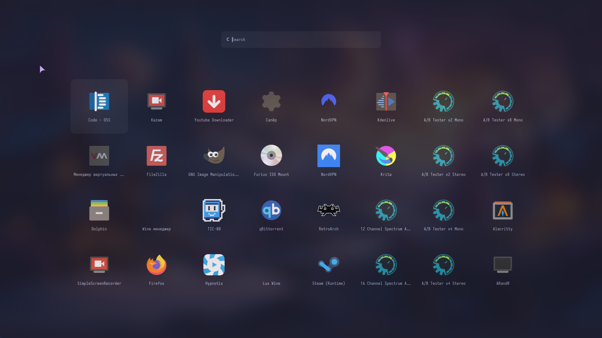
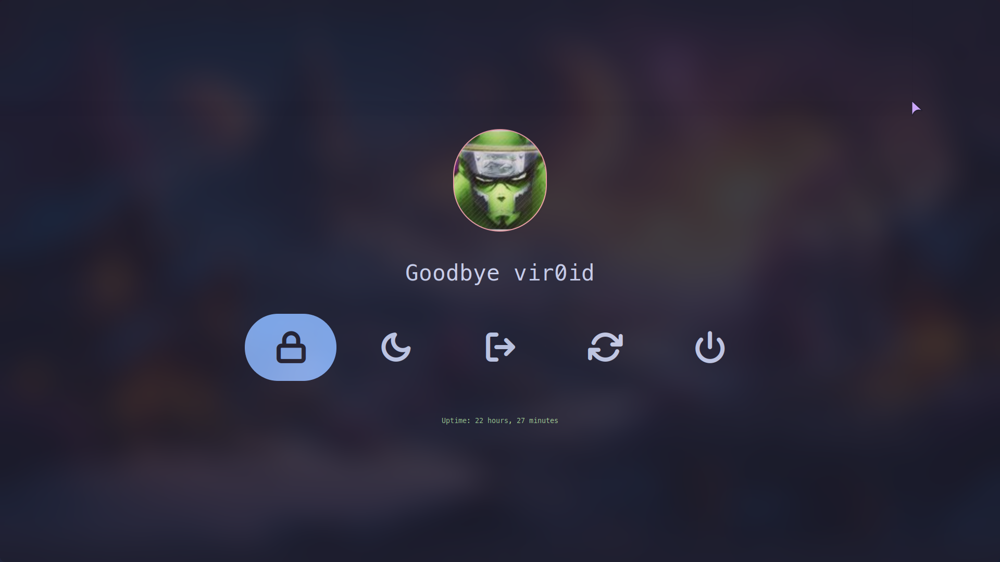
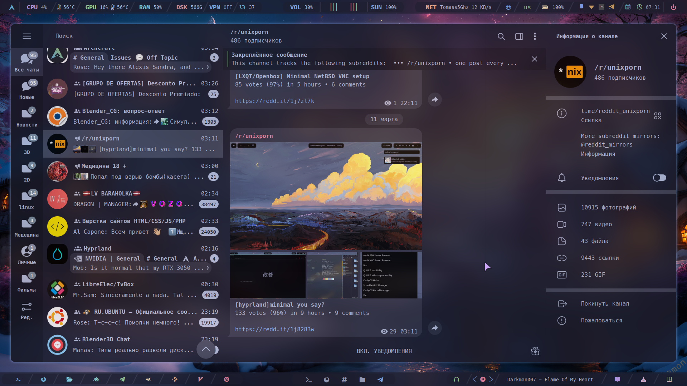
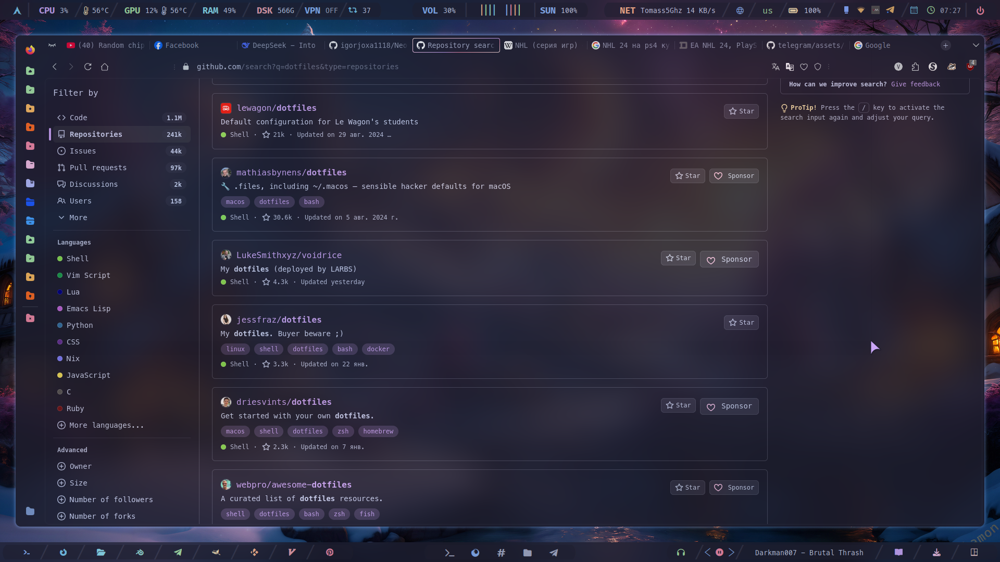

## Information


- **OS:** [Any Arch Based Distro](https://en.wikipedia.org/wiki/Arch_Linux)
- **WM:** [i3-wm](https://github.com/Airblader/i3)
- **Terminal:** [Kitty](https://sw.kovidgoyal.net/kitty/)
- **Text Editor:** [Visual-code](https://code.visualstudio.com/) [Micro](https://micro-editor.github.io/)
- **File Manager:** [Thunar](https://github.com/neilbrown/thunar) [Ranger](https://github.com/ranger/ranger)
- **Fonts:** [MesloLGS NF](https://github.com/romkatv/powerlevel10k#meslo-nerd-font-patched-for-powerlevel10k) [Iosevka Term](https://github.com/be5invis/Iosevka)
- **Bar:** [Polybar](https://github.com/polybar/polybar)
- **Shell:** [Ohmyzsh](https://ohmyz.sh/)
- **Compositor:** [Picom](https://github.com/yshui/picom)
- **Application Launcher:** [Rofi](https://github.com/davatorium/rofi)
- **Notification Deamon:** [Dunst](https://github.com/dunst-project/dunst)
- **Splitt terminal:** [Autotiling](https://github.com/nwg-piotr/autotiling)
- **Video Card:** [Nvidia](https://developer.nvidia.com/nvidia-system-management-interface) [Intel](https://www.intel.com/content/www/us/en/support/articles/000005520/graphics.html)
- **Backlight:** [Nvidia-smi](https://developer.nvidia.com/nvidia-system-management-interface)
- **Music Player:** [Mpd](https://www.musicpd.org/) [ncmpcpp](https://wiki.archlinux.org/title/Ncmpcpp) [Ymuse](https://github.com/yktoo/ymuse)
- **Music Player Youtube Playlists:** [Mpv](https://mpv.io/)


Установочный скрипт тестировался на чистом Arch Linux в виртуальной машине. 
Если у вас появятся какие-то проблемы в процессе установки, то я вас предупрежу:
> [!CAUTION]
> ⚠️⚠️⚠️ Пожалуйста, сделайте бэкап!!
> см.в "Ручная установка"!! ⚠️⚠️⚠️  

Если у вас чистая система, тогда скрипт нужно запускать два раза. 
Первый раз это нужно для того, что бы Firefox создал свои файлы и каталоги настроек в ~/.mozilla/. 

> [!IMPORTANT]
> Важно запустить Firefox и закрыть.
> Затем запустить скрипт второй раз.

Если у вас система не с нуля, тогда скрипт запускается один раз.

Этот скрипт проверит, есть ли у вас необходимые пакеты, и если нет, тогда он их установит. 
Этот скрипт сделает бэкап сам в каталог ~/.Backup_files

<br>

> [!CAUTION]
> ⚠️⚠️⚠️ После запуска скрипта, вам будет предложены соглашения с вашими действиями.
> Будте на чеку!! ⚠️⚠️⚠️

<br>

После установки файлов последует перезагрузка. Если вы устанавливаете в виртуальную машину, тогода после входа в систему picom работать не будет.
Вам потребуется закоментировать строку запускающую picom в автостарт. ~/.config/i3/autostart или альтернативные вариант: Открыть консоль(это можно сделать в qemu) и просто написать killall picom - enter. 

Скрипт так же можно использовать с Intel картой.












# Arch Linux Rice Installation Script

Этот скрипт предназначен для автоматической настройки и установки окружения на Arch Linux. Он устанавливает необходимые пакеты, настраивает темы, шрифты, иконки, а также применяет конфигурации для различных компонентов системы, таких как Firefox, SDDM, GRUB и другие.

## Функционал скрипта

1. **Установка зависимостей**:
   - Скрипт проверяет и устанавливает все необходимые пакеты из официальных репозиториев Arch Linux и AUR.
   - Устанавливает такие пакеты, как `firefox`, `alacritty`, `polybar`, `rofi`, `picom`, `zsh`, и многие другие.

2. **Установка AUR-помощника `paru`**:
   - Если `paru` не установлен, скрипт автоматически установит его для работы с AUR-пакетами.

3. **Установка AUR-пакетов**:
   - Скрипт устанавливает дополнительные пакеты из AUR, такие как `cava`, `tor-browser-bin`, `eww-git`, и другие.

4. **Резервное копирование файлов**:
   - Скрипт создает резервную копию текущих конфигурационных файлов в папку `~/.Backup_files`.

5. **Установка dot-файлов**:
   - Скрипт копирует конфигурационные файлы (dot-файлы) из текущей директории в домашнюю директорию пользователя.
   - Устанавливает темы для GRUB и SDDM.

6. **Настройка Firefox**:
   - Скрипт копирует темы и расширения для Firefox в соответствующие папки профиля.

7. **Настройка SDDM**:
   - Скрипт устанавливает и настраивает SDDM как менеджер входа в систему, применяя тему `catppuccin-mocha`.

8. **Настройка GRUB**:
   - Скрипт применяет тему `catppuccin-mocha` для GRUB.

9. **Настройка окружения**:
   - Скрипт настраивает окружение для работы с виртуальными машинами (libvirt) и добавляет пользователя в группу `libvirt`.
   - Настраивает MPD (Music Player Daemon) для работы на уровне пользователя.

10. **Смена оболочки на Zsh**:
    - Скрипт меняет оболочку по умолчанию на Zsh, если она еще не установлена.

11. **Перезагрузка системы**:
    - После завершения установки скрипт предлагает перезагрузить систему для применения всех изменений.

## Как использовать

1. **Клонируйте репозиторий**:
   ```bash
   git clone https://github.com/igorjoxa1118/NeoCity.git
   cd NeoCity
   chmod +x install.sh
   ./install.sh

Следуйте инструкциям:
Скрипт будет запрашивать подтверждение НЕ на каждом этапе установки. Внимательно читайте сообщения и отвечайте на вопросы.

Перезагрузите систему:
После завершения установки рекомендуется перезагрузить систему для применения всех изменений.

Логирование ошибок
Все ошибки, возникающие в процессе установки, записываются в файл RiceError.log, который находится в домашней директории пользователя. Если что-то пошло не так, проверьте этот файл для получения дополнительной информации.

Зависимости
Скрипт требует наличия следующих инструментов:

`sudo`
`git`
`pacman` (пакетный менеджер Arch Linux)
`curl` (для загрузки файлов)

Поддерживаемые окружения
Скрипт был протестирован на Arch Linux и производных дистрибутивах (например, Manjaro). Для других дистрибутивов могут потребоваться дополнительные настройки.

Автор

[vir0id]

# Руководство по настройке и использованию i3wm

Этот файл содержит описание конфигурации и комбинаций клавиш для оконного менеджера **i3wm**. Здесь вы найдете информацию о том, как управлять окнами, переключаться между рабочими пространствами, запускать приложения и использовать различные скрипты для автоматизации задач.

## Основные комбинации клавиш

### Управление окнами
- **$mod + q** — Закрыть текущее окно.
- **$mod + f** — Переключить окно в полноэкранный режим.
- **$mod + c** — Переключить окно в плавающий режим.
- **$mod + g** — Закрепить окно поверх других (sticky).
- **$mod + h** — Разделить окно по горизонтали.
- **$mod + v** — Разделить окно по вертикали.
- **$mod + z** — Переключить между режимами разделения окон (столбик, строка, разделение).

### Переключение между окнами
- **$mod + j** — Переключить фокус на окно слева.
- **$mod + k** — Переключить фокус на окно внизу.
- **$mod + l** — Переключить фокус на окно вверху.
- **$mod + ;** — Переключить фокус на окно справа.
- **$mod + Left/Right/Up/Down** — Переключить фокус на окно в соответствующем направлении.

### Рабочие пространства
- **$mod + 1-0** — Переключиться на рабочее пространство от 1 до 10.
- **$mod + Shift + 1-0** — Переместить текущее окно на рабочее пространство от 1 до 10.
- **Ctrl + $mod + Left/Right** — Перемещение между рабочими пространствами влево/вправо.
- **Ctrl + Left/Right** — Переместить активное окно на соседнее рабочее пространство.

### Режим растягивания окон
- **$mod + Ctrl + r** — Войти в режим изменения размера окна.

### Плавающие окна и скрэтчпад
- **$mod1 + b** — Отправить окно в скрэтчпад.
- **$mod1 + n** — Показать окно из скрэтчпада.
- **$mod1 + m** — Переключить отображение скрэтчпада.

### Запуск приложений и скриптов
- **$mod + d** — Открыть меню запуска приложений через скрипт `OpenApps --menu`.
- **$mod + Return** — Открыть терминал через скрипт `OpenApps --terminal`.
- **$mod + $mod1 + Return** — Открыть файловый менеджер Yazi через скрипт `OpenApps --yazi`.
- **$mod + $mod1 + w** — Выбрать обои рабочего стола через скрипт `WallSelect -t 1`.
- **$mod + b** — Включить эффект мигания окна через скрипт `flash_window`.
- **$mod + $mod1 + u** — Проверить обновления системы через скрипт `OpenApps --checkupdates`.
- **$mod1 + t** — Открыть приложение в плавающем режиме через скрипт `OpenApps --floating`.
- **$mod1 + u** — Обновить систему через скрипт `OpenApps --update`.
- **$mod1 + Return** — Открыть файловый менеджер Ranger через скрипт `OpenApps --ranger`.
- **$mod1 + space** — Выбрать тему оформления через скрипт `RiceSelector`.
- **$mod + $mod1 + t** — Открыть терминал с выбором через скрипт `Term --selecterm`.
- **$mod + $mod1 + p** — Переключить композитор через скрипт `toggle-compositor.sh`.
- **$mod1 + q** — Найти и открыть приложение Thunar через скрипт `findapp thunar`.
- **$mod1 + Ctrl + k** — Показать справку по комбинациям клавиш через скрипт `KeybindingsHelp`.
- **$mod1 + f** — Запустить Firefox.
- **$mod1 + s** — Запустить Skippy-XD (утилита для просмотра всех окон).
- **$mod1 + e** — Запустить текстовый редактор Mousepad.
- **$mod1 + c** — Запустить файловый менеджер Thunar.
- **Print** — Запустить Kazam для записи экрана.
- **$mod + $mod1 + v** — Запустить меню видео через скрипт `rofi_video_dmenu/Launch.sh`.
- **$mod + Shift + k** — Запустить `xkill` для принудительного закрытия окна.
- **$mod + Shift + s** — Запустить Flameshot для создания скриншота.

### Управление i3
- **$mod + Shift + e** — Перезагрузить i3.
- **$mod + Shift + r** — Перезапустить i3.
- **$mod + $mod1 + Delete** — Выйти из i3 через скрипт `i3-logout`.
- **$mod + $mod1 + l** — Заблокировать экран через скрипт `virlock`.

### Дополнительные функции
- **$mod + Shift + g** — Войти в режим отступов (gaps).
- **$mod + Tab** — Запустить скрипт `launch_eww.sh` (вероятно, для запуска виджетов EWW).
- **$mod1 + x** — Переключить фокус между черепичными и плавающими окнами.
- **$mod + a** — Сфокусироваться на родительском контейнере.
- **$mod1 + d** — Сфокусироваться на дочернем контейнере.

## Настройка и кастомизация

Вы можете изменить или добавить новые комбинации клавиш в файле `keybinds`. Для этого отредактируйте файл и перезагрузите i3 с помощью команды:

```bash
$mod + Shift + r


---

### Пояснения:
1. **Скрипты и их назначение**:
   - `OpenApps` — универсальный скрипт для запуска приложений с различными параметрами (например, `--menu`, `--terminal`, `--yazi` и т.д.).
   - `WallSelect` — скрипт для выбора обоев рабочего стола.
   - `flash_window` — скрипт для мигания окна (вероятно, для привлечения внимания).
   - `toggle-compositor.sh` — скрипт для включения/выключения композитора.
   - `KeybindingsHelp` — скрипт для отображения справки по комбинациям клавиш.
   - `rofi_video_dmenu/Launch.sh` — скрипт для управления видео (возможно, через Rofi).

2. **Приложения**:
   - **Firefox**, **Thunar**, **Mousepad**, **Kazam**, **Flameshot** — стандартные приложения, которые запускаются через комбинации клавиш.

3. **Режимы**:
   - **Режим растягивания окон** — позволяет изменять размеры окон.
   - **Режим отступов (gaps)** — управляет отступами между окнами.

Теперь `README.md` стал более полным и детализированным, с описанием всех комбинаций клавиш и скриптов.
